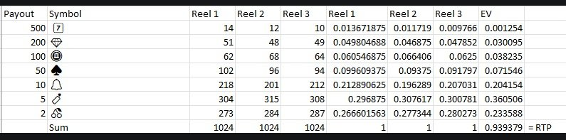

# 🎰 Destiny Slots

A probability-driven slot machine game built in **Java**, simulating real-world casino mechanics including weighted reels, RTP calculation, and animated spinning.

---

## 📌 Features

- Animated reel spinning with staggered stop timing
- Probability-based symbol distribution across 3 independent reels
- Full balance and bankroll system with bet validation
- Win/loss payout calculation (3-of-a-kind and 2-of-a-kind)
- Games played counter
- Play-again loop
- Terminal-cleared display for clean animation

---

## 🗂️ Project Structure

```
Slot_Machine/
├── Main.java       # Entry point, game loop
├── Reel.java       # Reel construction, spin logic, animation
├── Payout.java     # Win/loss detection and payout calculation
├── Print.java      # All terminal I/O, board rendering, input handling
├── Images/         # Symbol reference images
└── README.md
```

---

## ⚙️ Requirements

- Java **11** or higher
- Any terminal that supports ANSI escape codes (Linux, macOS, Windows Terminal)

---

## 🚀 How to Install & Run

**1. Clone the repository**
```bash
git clone https://github.com/your-username/Slot_Machine.git
cd Slot_Machine
```

**2. Compile**

The package name is `Slot_Machine`, so compile from the **parent directory** of the `Slot_Machine/` folder.

```bash
javac Slot_Machine/*.java
```

**3. Run**

```bash
java Slot_Machine.Main
```

---

## 🎮 How to Play

1. Enter your starting balance when prompted
2. Enter your bet amount for the round
3. Press `1` to spin or `2` to exit
4. Watch the reels animate and stop one by one
5. Your result and updated balance are shown after each spin
6. Choose to play again or exit

---

## 🎲 Mathematics

This project doesn't rely on pure randomness — it implements the mathematical principles used in real-world slot machines.

### Symbol Weights

Each symbol appears a different number of times across the 1024-position virtual reel, giving each reel a unique probability distribution.

| Symbol | Reel 1 | Reel 2 | Reel 3 |
|--------|--------|--------|--------|
| 7️⃣     | 14     | 12     | 10     |
| 💎     | 51     | 48     | 49     |
| 🪙     | 62     | 68     | 64     |
| ♠️     | 102    | 96     | 94     |
| 🔔     | 218    | 201    | 212    |
| 🧨     | 304    | 315    | 308    |
| 🍒     | 273    | 284    | 287    |
| **Sum**| **1024**| **1024**| **1024**|

### Payout Table (3-of-a-kind)

| Symbol | Multiplier |
|--------|-----------|
| 7️⃣     | 500×      |
| 💎     | 200×      |
| 🪙     | 100×      |
| ♠️     | 68×       |
| 🔔     | 20×       |
| 🧨     | 10×       |
| 🍒     | 5×        |

2-of-a-kind pays **1.17×** the bet regardless of symbol.

### Return to Player (RTP)

The RTP is the expected percentage of all wagered money returned to the player over time. It is calculated as:

$$\text{EV per symbol} = P(\text{Reel 1}) \times P(\text{Reel 2}) \times P(\text{Reel 3}) \times \text{Payout multiplier}$$

$$\text{RTP} = \sum_{\text{all symbols}} \text{EV}$$

The full probability breakdown per symbol and reel is shown below:



**Total RTP ≈ 93.9%** — meaning for every $1 wagered, the expected return is ~$0.94, closely matching the house edge of real-world slot machines (~94–96% RTP).

---

## 🔧 Configuration

To change the game's difficulty or payout structure, edit these values:

- **Reel weights** → `Reel.java` — adjust the `reel_weights` array (each row must sum to 1024 to maintain probability calculations)
- **Payout multipliers** → `Payout.java` — edit the `payout3` HashMap values and `payout2` for 2-of-a-kind
- **Spin animation speed** → `Reel.java` — edit the `speed` array `{ 20, 25, 30 }` and the `Thread.sleep` delay

---

## 📋 Status

**Complete** — all core features implemented and working.

| Feature | Status |
|---------|--------|
| Weighted reel generation | ✅ |
| Spin animation | ✅ |
| Bet & balance system | ✅ |
| Win/loss detection | ✅ |
| Payout calculation | ✅ |
| Input validation | ✅ |
| Game loop / play again | ✅ |

---

## 📄 License

MIT License — free to use, modify, and distribute.
